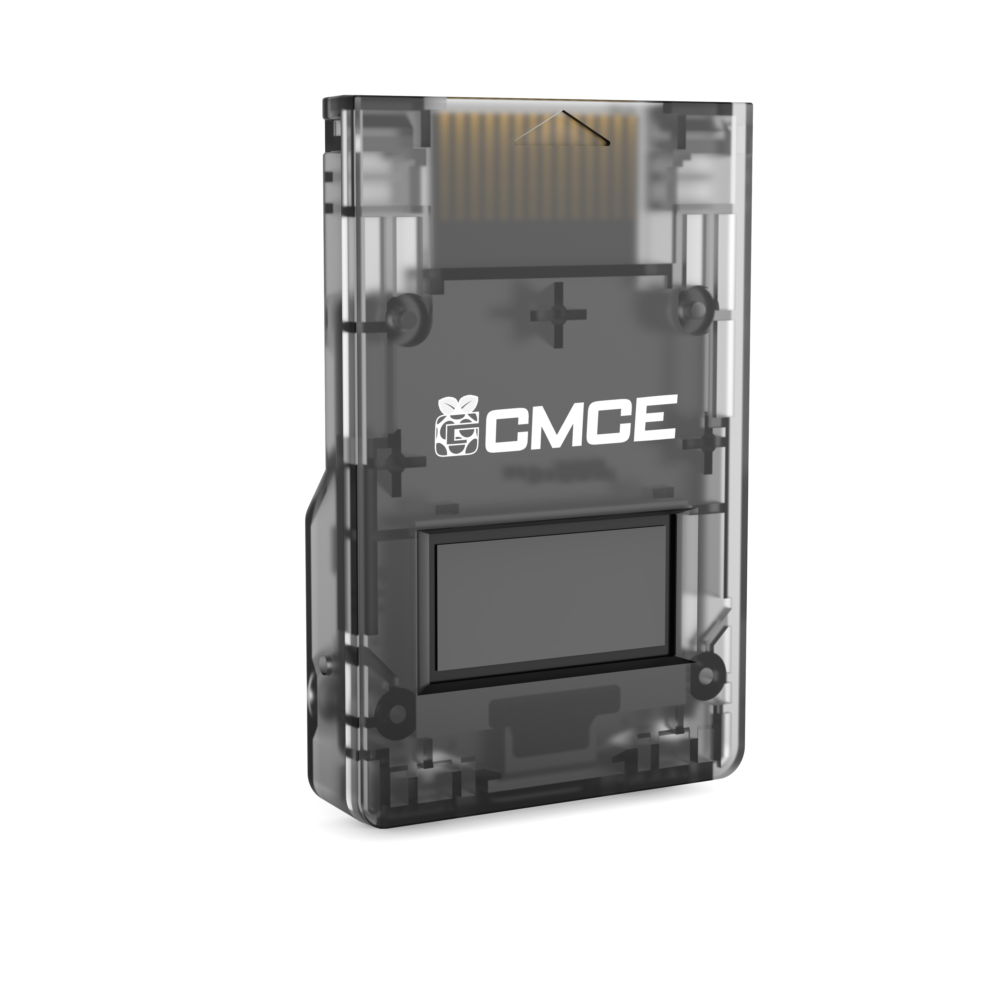

# Getting Started with GCMCE

{width=50%}

**GCMCE** is a FlipperMCE version designed and created by BitFunX. It is available at the usual marketplaces like aliexpress or through their website [https://www.bitfunx.com](https://www.bitfunx.com).

## Firmware

### Update / Install Firmware

To install the firmware, connect the assembled GCMCE to your computer while **holding any of the buttons**.

A new drive will pop up on your computer called **RPI-RP2**. Copy over the *flippermce.uf2* file.

**Note:** The drive will automatically disconnect after copying.

### Emergency Update

If (for whatever reason) your GCMCE became corrupted or cannot start up in the normal firmware update mode anymore, please **press and hold the hidden button on the _right side_ of FlipperMCE** while connecting to USB.

A new drive will pop up on your computer called **RPI-RP2**. Copy over the *flippermce.uf2* file.

**Note:** The drive will automatically disconnect after copying.
