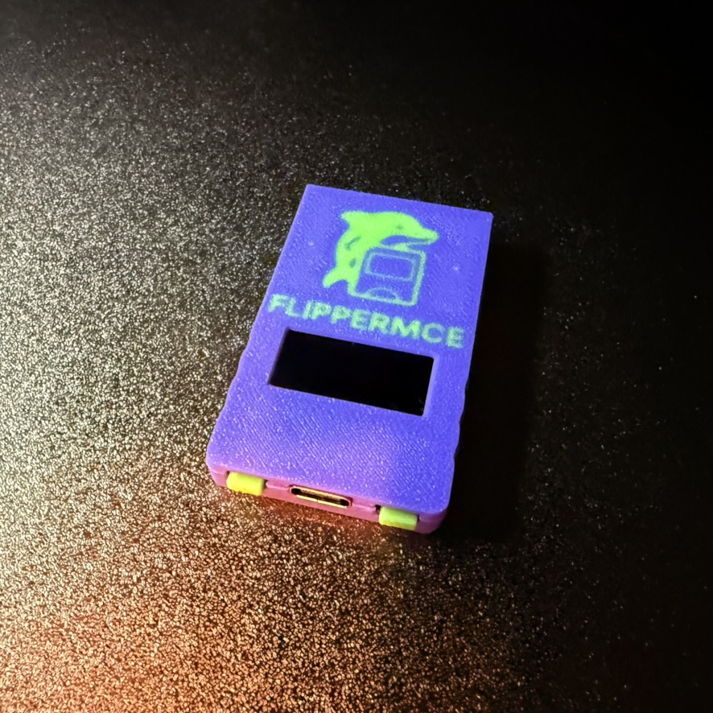

# Getting Started with FlipperMCE

{width=50%}

Welcome to the FlipperMCE Getting Started guide! This guide will walk you through obtaining the hardware, assembling your device, and installing the firmware.

## Hardware

You can get the hardware for *FlipperMCE* in different ways:

### Buy one assembled from a PCB manufacturer like JLCPCB/PCBWay

**When ordering with any PCB manufacturer, make sure to:**

- **Use 0.8mm PCB thickness**
- **ENIG finish**

You can find all manufacturing files in our [PCB Repository](https://github.com/FlipperMCE/pcb/releases).

#### Case

To get the official case for FlipperMCE, please head over to the [PCB repository](https://github.com/FlipperMCE/pcb/tree/main/case).

#### Assembly

**Assembly Steps:**

1. **Add the Buttons** to the top shell
2. **Connect the Display** to the PCB
3. **Add the Display Bracket** to the PCB (it will only fit one way), under the display flex cable
4. **Drop the PCB + Display + Display Bracket sandwich** into the top shell
5. **Angle-In the Bottom Shell**
6. **Fit the screws**

## Firmware

### Update / Install Firmware

Download the current FlipperMCE (*flippermce.uf2*) release at the [Firmware Repository](https://github.com/FlipperMCE/firmware/releases).

To install the firmware, connect the assembled FlipperMCE to your computer while **holding any of the buttons**.

A new drive will pop up on your computer called **RPI-RP2**. Copy over the *flippermce.uf2* file.

**Note:** The drive will automatically disconnect after copying.

### Emergency Update

If (for whatever reason) your FlipperMCE became corrupted or cannot start up in the normal firmware update mode anymore, please **press and hold the hidden button on the _right side_ of FlipperMCE** while connecting to USB.

A new drive will pop up on your computer called **RPI-RP2**. Copy over the *flippermce.uf2* file.

**Note:** The drive will automatically disconnect after copying.
