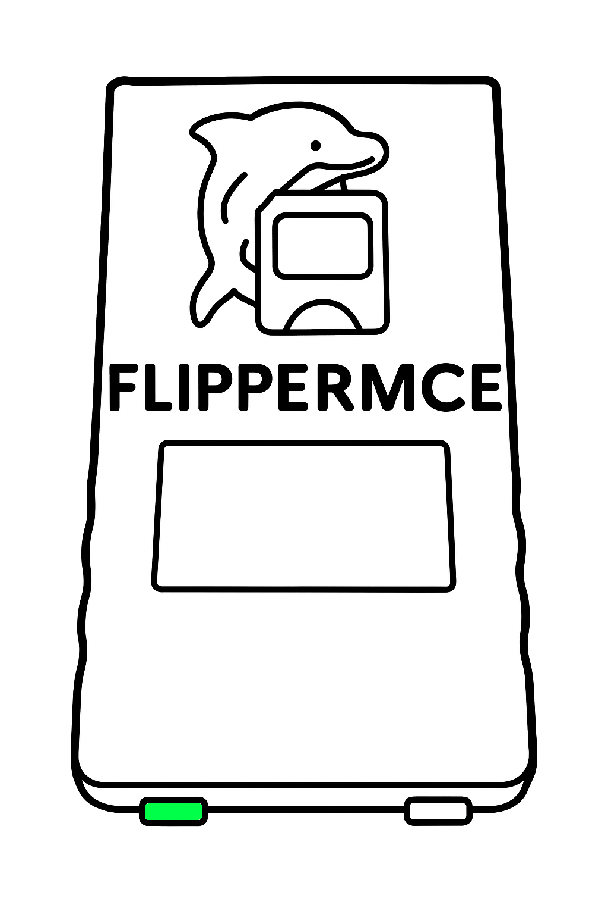
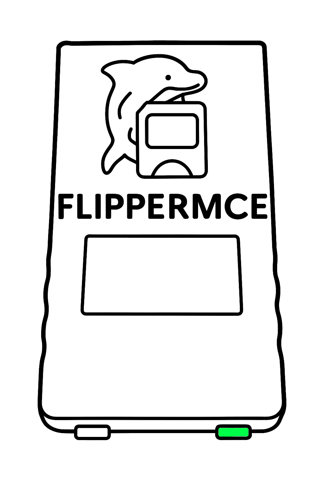
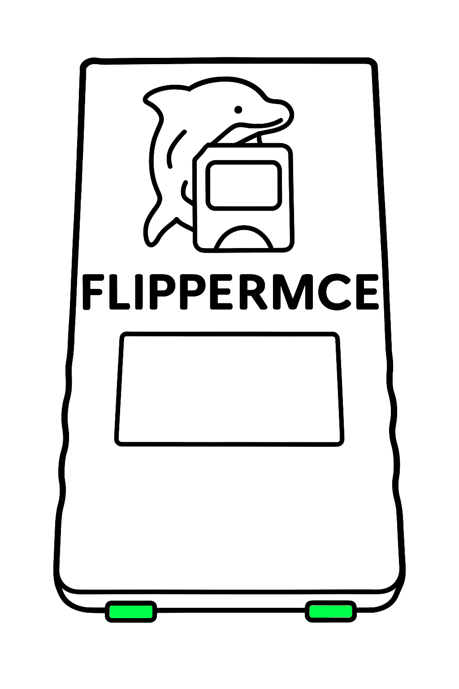

# FlipperMCE Navigation

This guide explains how to navigate your FlipperMCE device using the buttons and menu system. Learn how to switch between cards, access settings, and customize your device.

{width=30%} {width=30%}

## Navigating Cards

FlipperMCE provides simple button combinations to navigate through your memory card images:

| Action |  Result |
|--------|----------|
| Short press | Switch card channel up/down |
| Long press | Switch card up/down |

**Note:** To access your named or GameID cards manually, switch your card down while on Card Index 1.

## Opening the Menu

{width=50%}

Press both buttons simultaneously to open the menu interface. This provides access to all device settings and information.

## Navigating the Menu

| Action | Result |
|--------|----------|
| Short press left |  Move up in menu |
| Short press right | Move down in menu |
| Long press right |  Enter submenu/change value |
| Long press left | Go back |

## Menu Items

### Card Settings
Configure settings for newly created memory cards:

- **Card Restore:** Reload card from last session at startup
- **Game ID:** Create cards for each game transmitted to FlipperMCE
- **Size:** Select size of new card images (in blocks)
- **Encoding:** Choose Japanese or World encoding for new non-GameID cards

### Display Settings
Customize your device's display:

- **Auto Off:** Enable display timeout to save power
- **Contrast:** Adjust display contrast
- **Flip:** Rotate display 180 degrees
- **Show Info:** Toggle card information on main screen

### System Information
View technical details about your device:

- **Version:** Current firmware version (or nightly build)
- **Commit:** Git commit hash of current build
- **Debug:** Indicates if running a debug build